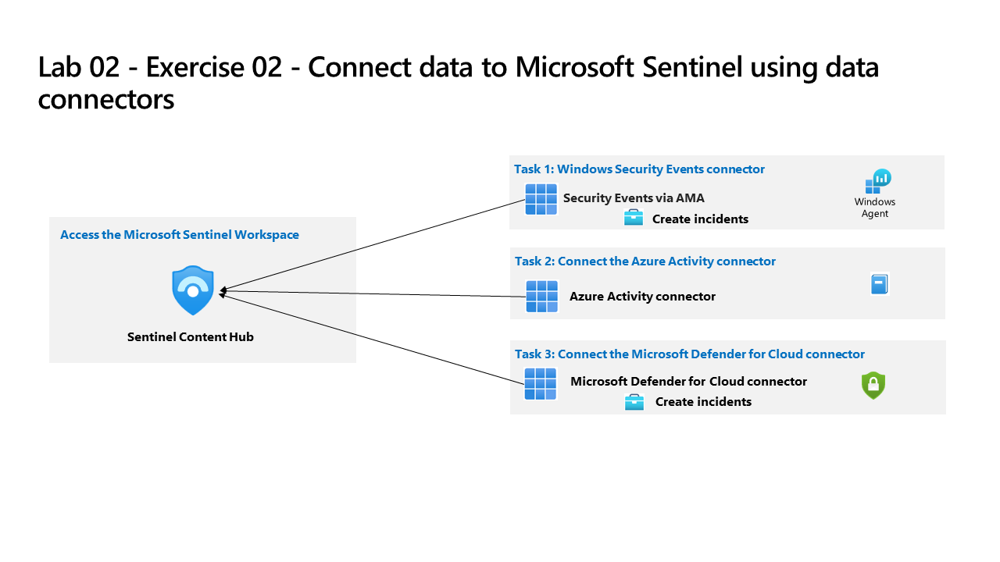

---
lab:
  title: '演習 02: Windows セキュリティ イベント データを取り込む'
  module: Guided Project - Deploy Microsoft Sentinel Content Hub solutions and data connectors
---

>**注**: このラボはラボ 01 に基づいて構築されています。 このラボを完了するには、[Azure サブスクリプション](https://azure.microsoft.com/free/?azure-portal=true)が必要です。 管理アクセス権を持つ。

## 一般的なガイドライン

- オブジェクトを作成するときは、異なる構成を必要とする要件がない限り、既定の設定を使用します。
- オブジェクトの作成、削除、または変更は、指定された要件を達成するためにのみ行います。 環境に対する不要な変更は、最終的なスコアに悪影響を与える可能性があります。
- 目標を達成するための複数の方法がある場合は、常に最小限の管理労力で済むアプローチを選択します。

Microsoft Sentinel のソリューションを使用してデータを取り込むよう Microsoft Sentinel を構成する必要があります。

## アーキテクチャ ダイアグラム

## スキルアップ タスク

Microsoft Sentinel ワークスペースにコンテンツ ハブのソリューションをデプロイし、次の要件を満たす必要があります。

- 次のソリューションをインストールします。
  - Windows Security Events。
  - Azure アクティビティ コネクタ。
  - Microsoft Defender for Cloud。
- サブスクリプション内のすべての新規および既存のリソースを適用するように、Azure アクティビティのデータ コネクタを構成します。
- Azure サブスクリプションに接続するように Microsoft Defender for Cloud のデータ コネクタを構成し、双方向同期のみが有効になっていることを確認します。
- 疑わしい数のリソース作成またはデプロイ アクティビティ テンプレートに基づいて分析ルールを有効にします。 ルールは 1 時間ごとに実行し、その過去 1 時間のデータのみを参照する必要があります。
- Azure アクティビティ ブックがマイ ブックで使用できることを確認します。

## 演習の手順

>**注**: 次のタスクでは、`Microsoft Sentinel` にアクセスするために、ラボ 01 で作成した `workspace` を選択します。

### タスク 1 - Microsoft Sentinel コンテンツ ハブのソリューションをデプロイする

コンテンツ ハブのソリューションをデプロイし、データ コネクタを構成します。 詳細については、[コンテンツ ハブのソリューション](https://learn.microsoft.com/azure/sentinel/sentinel-solutions)を参照してください。

1. `Microsoft Sentinel` で、`Content management` メニュー セクションに移動し、**[コンテンツ ハブ]** を選択します
1. **Windows Security Events**を検索して選択します
1. **[詳細の表示]** のリンクを選択します
1. Windows セキュリティ イベント プランを選択し、**[作成]** を選択します。
1. Microsoft Sentinel ワークスペースを含む `RG2` リソース グループを選択し、`Workspace` を選択します。
1. **[次へ]** を選択し、[Data Connectors] タブに移動します (ソリューションは 2 つのデータ コネクタをデプロイします)。
1. **[次へ]** を選択し、[Workbooks] タブに移動します (ソリューションはブックをインストールします)。
1. **[次へ]** を選択し、[Analytics] タブに移動します (ソリューションは分析ルールをインストールします)。
1. **[次へ]** を選択し、[Hunting Queries] タブに移動します (ソリューションはハンティング クエリをインストールします)。
1. **[確認と作成]** を選択します
1. **[作成]** を選択します。

1. `Azure Activity` と `Microsoft Defender for Cloud` のソリューションに対してこれらの手順を繰り返します。

### タスク 2 - Azure アクティビティのデータ コネクタを設定する

サブスクリプション内のすべての新規および既存のリソースを適用するように、Azure アクティビティのデータ コネクタを構成します。 詳細については、[Microsoft Sentinel データ コネクタ](https://learn.microsoft.com/azure/sentinel/connect-data-sources)を参照してください。

  1. `Microsoft Sentinel` で、`Content management` メニュー セクションに移動し、**[コンテンツ ハブ]** を選択します。
  1. `Content hub` で、インストールされているソリューションの `Status` をフィルター処理します。
  1. `Azure Activity` のソリューションを選択し、**[管理]** を選択します。
  1. `Azure Activity` のデータ コネクタを選択し、**[コネクタ ページを開く]** を選択します。
  1. `Configuration` 領域の `Instructions` タブで、`2. Connect your subscriptions...` まで下にスクロールし、**[Azure ポリシーの割り当てウィザードの起動>]** を選択します。
  1. **[基本]** タブで、**[スコープ]** の下にある省略記号ボタン (...) を選択し、ドロップダウン リストから [サブスクリプション] を選んで、**[Select]** をクリックします。
  1. **[パラメーター]** タブを選び、**[プライマリ Log Analytics ワークスペース]** ドロップダウン リストから自分のワークスペースを選びます。
  1. **[修復]** タブを選択し、 **[修復タスクを作成する]** チェック ボックスをオンにします。
  1. **[確認および作成]** ボタンを選択して構成を確認します。
  1. **[作成]** を選択して完了します。
  
### タスク 3 - Defender for Cloud のデータ コネクタを設定する

Microsoft Defender for Cloud のデータ コネクタを構成し、インシデント管理のみが構成されていることを確認します。

  1. `Microsoft Sentinel` で、`Content management` メニュー セクションに移動し、**[コンテンツ ハブ]** を選択します。
  1. `Content hub` で、インストールされているソリューションの `Status` をフィルター処理します。
  1. `Microsoft Defender for Cloud` のソリューションを選択し、**[管理]** を選択します。
  1. `Subscription-based Microsoft Defender for Cloud (Legacy)` のデータ コネクタを選択し、**[コネクタ ページを開く]** を選択します
  1. `Configuration` 領域の `Instructions` タブで、サブスクリプションまで下にスクロールし、`Status` 列のスライダーを **[接続済み]** に移動します。
  1. `Bi-directional sync` が **有効** になっていることを確認します。

### タスク 4 - 分析ルールを作成する

疑わしい数のリソース作成またはデプロイ アクティビティ テンプレートに基づいて分析ルールを作成します。 ルールは 1 時間ごとに実行し、その過去 1 時間のデータのみを参照する必要があります。 詳細については、[Microsoft Sentinel Analytic ルール テンプレートの使用](https://learn.microsoft.com/azure/sentinel/detect-threats-built-in)を参照してください。

  1. `Microsoft Sentinel` で、`Configuration` メニュー セクションに移動し、**[分析]** を選択します。
  1. `Rule templates` タブで、**疑わしい数のリソース作成アクティビティまたはデプロイ アクティビティ**を検索します。
  1. [**Suspicious number of resource creation or deployment activities**] を選択し、[**ルールの作成**] を選択します。
  1. `General` タブの既定値をそのままにして、**[次へ: ルール ロジックを設定 >]** を選択します。
  1. 既定の `Rule query` のままにし、テーブルを使用して `Query scheduling` を構成します。

     |設定 |値|
     |---|---|
     |クエリの実行間隔|1 時間|
     |次の時間分の過去のデータを参照します|1 時間|

  1. **[次へ: インシデントの設定 >]** を選びます。
  1. 既定値のままにして、**[次へ: 自動応答 >]** を選択します。
  1. 既定値のままにして、**[次へ: 確認と作成 >]** を選択します。
  1. **[保存]** を選択します。

### タスク5 - Azure アクティビティ ブックがマイ ブックで使用できることを確認する

  1. `Microsoft Sentinel` で、`Content management` メニュー セクションに移動し、**[コンテンツ ハブ]** を選択します。
  1. `Content hub` で、インストールされているソリューションの `Status` をフィルター処理します。
  1. `Azure Activity` のソリューションを選択し、**[管理]** を選択します。
  1. `Azure Activity` のブックの `checkbox` を選択してから、**[構成]** を選択します。
  1. `Azure Activity` のブックを選択し、**[保存]** を選択します。
  1. `Microsoft Sentinel` ワークスペースの `Azure Region` を選択します。  
