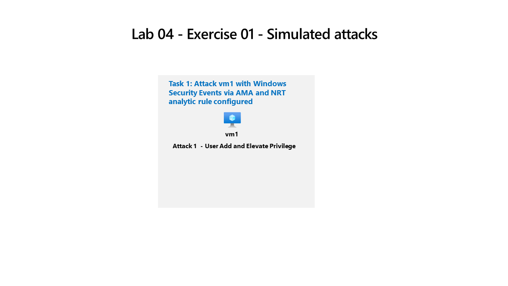

---
lab:
  title: '演習 04: シミュレートされた攻撃を実行する'
  module: Guided Project - Perform a simulated attack to validate Analytic and Automation rules
---

>**注**: このラボはラボ 01、02、03 に基づいて構築されています。 このラボを完了するには、[Azure サブスクリプション](https://azure.microsoft.com/free/?azure-portal=true)が必要です。 管理アクセス権を持つ。

## 一般的なガイドライン

- オブジェクトを作成するときは、異なる構成を必要とする要件がない限り、既定の設定を使用します。
- オブジェクトの作成、削除、または変更は、指定された要件を達成するためにのみ行います。 環境に対する不要な変更は、最終的なスコアに悪影響を与える可能性があります。
- 目標を達成するための複数の方法がある場合は、常に最小限の管理労力で済むアプローチを選択します。

Microsoft Sentinel のデプロイがセキュリティ イベントを受け取り、Windows を実行する仮想マシンからインシデントを作成していることを検証する必要があります。

## アーキテクチャ ダイアグラム



## スキルアップ タスク

シミュレートされた攻撃を実行して、分析と自動化のルールがインシデントを作成し、それを `Operator1` に割り当てることを検証する必要があります。 あなたは `vm1` 上で単純な `Privilege Escalation` 攻撃を実行します。

## 演習の手順

### タスク 1 - シミュレートされた特権エスカレーション攻撃を実行する

シミュレートされた攻撃を使用して、Microsoft Sentinel で分析ルールをテストします。 詳細については、[特権エスカレーション攻撃のシミュレーション](https://github.com/redcanaryco/atomic-red-team/blob/master/atomics/T1078.003/T1078.003.md)を参照してください。

1. Azure で **vm1** 仮想マシンを見つけて選択し、メニュー項目を **[操作]** まで下にスクロールして、**[コマンドの実行]** を選択します。
1. **[コマンドの実行]** ペインで、**[RunPowerShellScript]** を選択します
1. 以下のコマンドをコピーして、`PowerShell Script` フォームへの管理アカウントの作成をシミュレートし、**[実行]** を選択します

    ```CommandPrompt
    net user theusernametoadd /add
    net user theusernametoadd ThePassword1!
    net localgroup administrators theusernametoadd /add
    ```

>**注**: 1 行にコマンドが 1 つだけあることを確認してください。ユーザー名を変更するとコマンドを再実行できます。

1. `Output` ウィンドウに `The command completed successfully` が 3 回表示されます

### タスク 2 - シミュレートされた攻撃からインシデントが作成されたことを確認する

分析ルールと自動化の条件に一致するインシデントが作成されていることを確認します。 詳細については、[Microsoft Sentinel インシデントの管理](https://learn.microsoft.com/azure/sentinel/incident-investigation)を参照してください。

1. `Microsoft Sentinel` で、`Threat management` メニュー セクションに移動し、**[インシデント]** を選択します
1. 作成した `NRT` ルールで構成した `Severity` と `Title` に一致するインシデントが表示されます
1. `Incident` を選択すると、`detail` ウィンドウが開きます
1. `Owner` 割り当ては **Operator1** で、`Automation rule` から作成され、`Tactics and techniques` は (`NRT` ルールからの) **特権エスカレーション** である必要があります
1. **[完全な詳細の表示]** を選択して、すべての `Incident management` 機能と `Incident actions` を表示します
